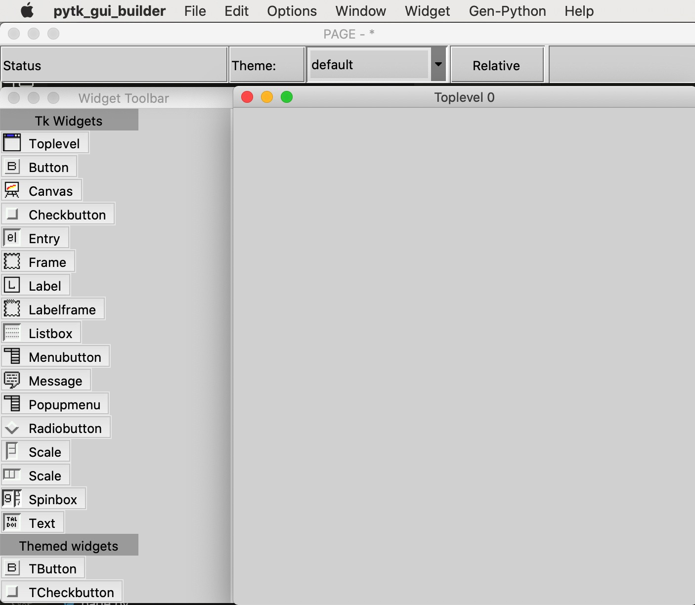
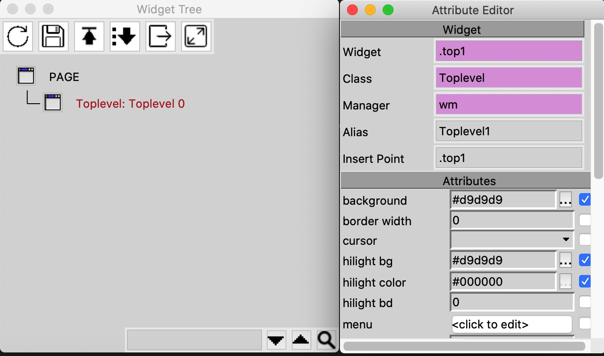

# PyTK GUI Builder

PyTK GUI Builder 是一个基于 [PAGE](https://page.sourceforge.net/) 项目的增强版 Tkinter GUI 构建工具，专为 Python 3 设计。通过直观的拖放界面，让开发者能够快速创建专业的 Tkinter GUI 应用程序。

## 🌟 主要特性

- **拖放式界面设计**：类似 Visual Basic 的可视化设计体验
- **跨平台支持**：原生支持 Windows、macOS 和 Linux 平台
- **纯 Python 3 代码生成**：生成的代码完全基于 Python 3 标准库
- **多窗口应用支持**：支持创建包含多个顶级窗口的复杂 GUI 应用
- **丰富的控件库**：内置完整的 Tk/ttk 控件集合
- **主题和样式支持**：支持 Ttk 主题和自定义样式
- **图像处理支持**：集成 Img 库，支持多种图像格式（JPEG、PNG、GIF 等）


## 界面截图







## 🚀 相比原版 PAGE 的改进

### 跨平台可执行文件支持
- ✅ **Windows**: 提供 32位 (win32) 和 64位 (win64) 版本
- ✅ **macOS**: 提供 Intel 架构的 Darwin64 版本
- ✅ **Linux**: 提供 64位 Linux 版本

### 技术改进
- **PyInstaller 打包优化**：支持将应用打包为原生可执行文件
- **智能路径检测**：自动适配不同安装环境（开发/打包）
- **增强的错误处理**：提供详细的调试信息和错误报告
- **CI/CD 集成**：通过 GitHub Actions 实现自动化构建和发布

## 📦 安装和使用

### 预编译版本
从 [GitHub Releases](https://github.com/tekintian/releases) 下载对应平台的可执行文件：
- Windows: `pytk_gui_builder-win64.zip` 或 `pytk_gui_builder-win32.zip`
- macOS: `pytk_gui_builder-Darwin64.zip`
- Linux: `pytk_gui_builder-Linux64.tar.gz`

### 源码运行
```bash
# 克隆项目
git clone https://github.com/tekintian/PyTK-GUI-Builder.git
cd PyTK-GUI-Builder

# 运行（需要 Python 3.7+）
python pytk_gui_builder.py
```

### 开发环境
```bash
# 创建虚拟环境
python -m venv venv
source venv/bin/activate  # Windows: venv\Scripts\activate

# 安装依赖
pip install pyinstaller

# 构建可执行文件
pyinstaller pytk_gui_builder.spec
```

## 🎯 使用流程

1. **启动应用**：运行 `pytk_gui_builder` 可执行文件
2. **创建窗口**：拖放控件到设计区域，调整属性和布局
3. **生成代码**：点击生成按钮，创建 GUI 模块和支持模块
4. **编写逻辑**：在生成的支持模块中添加业务逻辑代码
5. **测试运行**：直接在工具中测试 GUI 外观和交互

## 🏗️ 项目结构

PyTK-GUI-Builder/ 
├── pytk_gui_builder.py # 主程序入口 
├── page.tcl # PAGE 核心 Tcl 脚本 
├── pytk_gui_builder.spec # PyInstaller 打包配置 
├── Img/ # 平台相关的图像库
    ├── Img1.4.13-Darwin64/ # macOS 图像库 
    ├── Img1.4.13-Linux64/ # Linux 图像库 
    ├── Img1.4.13-win32/ # Windows 32位图像库
    └── Img1.4.13-win64/ # Windows 64位图像库 
├── assets/ # 应用图标和资源 
├── examples/ # 示例项目 
├── docs/ # 文档和教程 
└── .github/workflows/ # CI/CD 配置文件


## 🔧 技术架构

- **前端**：Tcl/Tk 8.6 + Tkinter
- **后端**：Python 3.7+
- **打包**：PyInstaller
- **CI/CD**：GitHub Actions
- **图像处理**：Img 扩展库（支持 JPEG、PNG、GIF、TIFF 等格式）

## 📋 系统要求

- **操作系统**：Windows 7+ / macOS 10.12+ / Linux (Ubuntu 16.04+)
- **Python**：3.7 或更高版本（仅源码运行时需要）
- **内存**：至少 512MB RAM
- **磁盘空间**：100MB 可用空间

## 🤝 贡献

欢迎提交 Issue 和 Pull Request！请参考我们的贡献指南。

## 📄 许可证

本项目基于 PAGE 项目开发，遵循原项目的许可证条款。

## 🙏 致谢

- 原 PAGE 项目团队：[https://page.sourceforge.net/](https://page.sourceforge.net/)
- Visual Tcl 项目贡献者
- Python 和 Tkinter 社区

---

**注意**：PyTK GUI Builder 专注于 GUI 窗口设计，不生成完整的应用程序逻辑。开发者需要在生成的代码基础上添加业务逻辑和功能实现。
